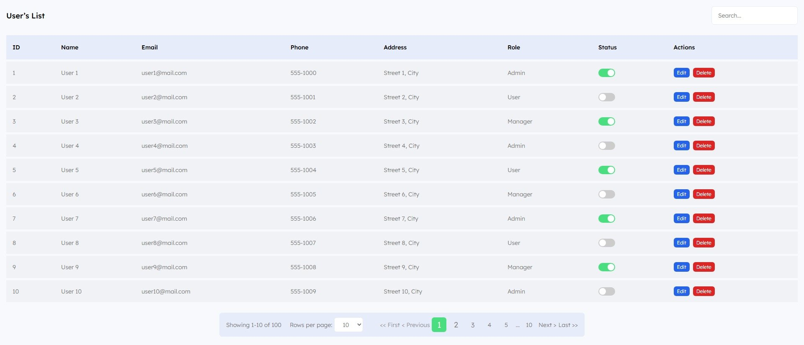
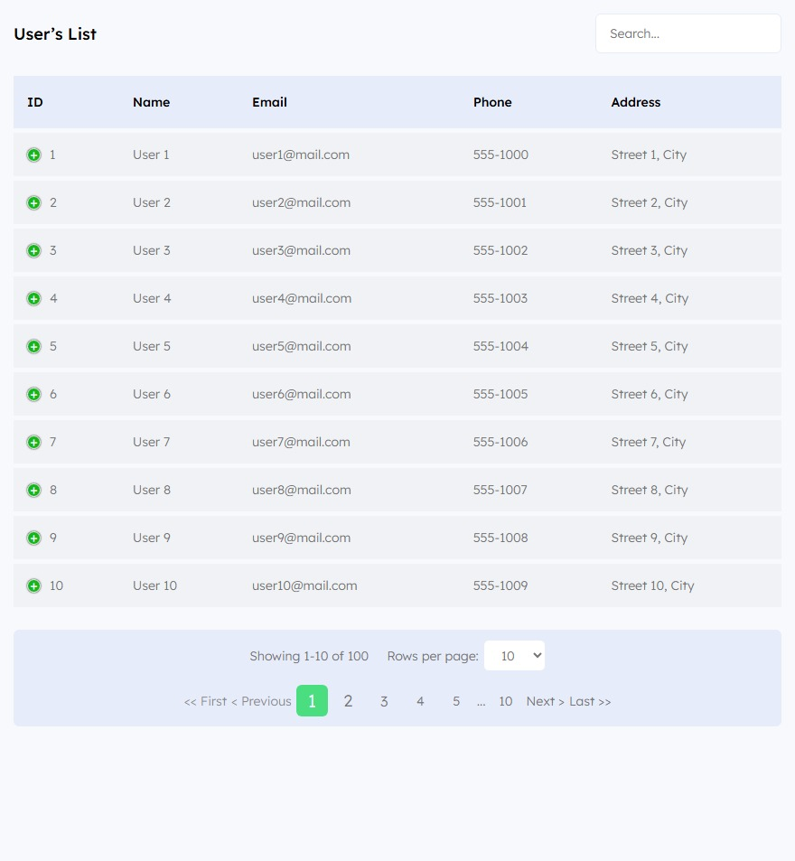
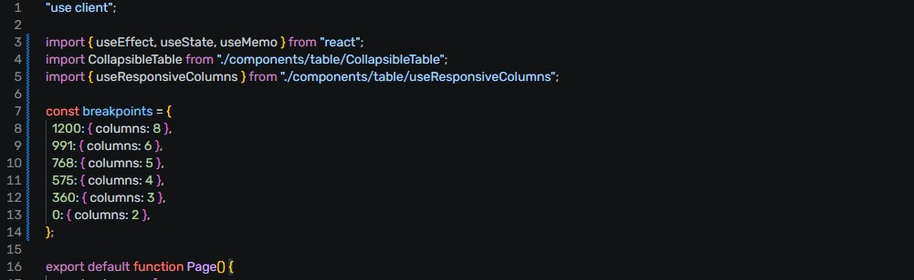

# 📊 Responsive Collapsible Data Table
A fully responsive and collapsible data table built with Next.js, supporting dynamic columns, mobile-friendly collapsible rows, pagination, search, and custom actions.

### 🔥 Features
1. Responsive Columns – Auto-hide columns on smaller screens.</br>
2. Collapsible Rows – Expand hidden columns on mobile.</br>
3. Custom Column Rendering – Toggle switches, action buttons (Edit/Delete).</br>
4. Pagination – First/Last, dynamic page numbers, rows per page selector.</br>
5. Search/Filtering – Global search across all columns.</br>
6. Skeleton Loading – Loading placeholders for table rows.</br>
7. Reusable Architecture – Modular components and hooks

## 🖼️ Screenshots
### 🖥️ Desktop View
<p align="center">  </p>

### 📱 Responsive / Mobile View
<p align="center">  </p>

### ⚙️ Breakpoint Settings
<p align="center">  </p>

## ⚙️ Breakpoint Example
```bash
const breakpoints = {
  1200: { columns: 8 },
  991: { columns: 6 },
  768: { columns: 5 },
  575: { columns: 4 },
  360: { columns: 3 },
  0: { columns: 2 },
};
```
Remaining columns automatically move into collapsible rows on mobile.

## 🚀 Getting Started
### 1. Clone the repository
```bash
git clone https://github.com/your-username/your-repo-name.git
cd your-repo-name
```
### 2. Install dependencies
```bash
npm install
# or
yarn install
# or
pnpm install
```
### 3. Run the development server
```bash
npm run dev
```

Open [http://localhost:3000](http://localhost:3000) with your browser to see the result.

## 📁 Project Structure
```bash
app/
 ├── page.js
 ├── layout.js
 ├── components/
 │    ├── table/
 │    │    ├── CollapsibleTable.js
 │    │    ├── useResponsiveColumns.js
 │    ├── Skeleton.js
 │    ├── Select.js
 ├── utils/
      └── constants.js
```

## 🧠 How It Works

### 1. Responsive Columns
useResponsiveColumns listens to window.resize</br>
Updates visible column indexes dynamically
### 2. Collapsible Rows
Hidden columns shown in expandable row with + / - toggle
### 3. Pagination
Client-side with dynamic page numbers</br>
Rows per page selector supported
### 4. Custom Column Renderers

Each column can have a custom render function:
```bash
{
  header: "Status",
  accessor: "status",
  render: (value, row) => <CustomToggle value={value} row={row} />
}
```

## 🔧 Customization
- Add or remove columns easily
- Modify breakpoints for different devices
- Extend with sorting, API-based data, or virtual scrolling
